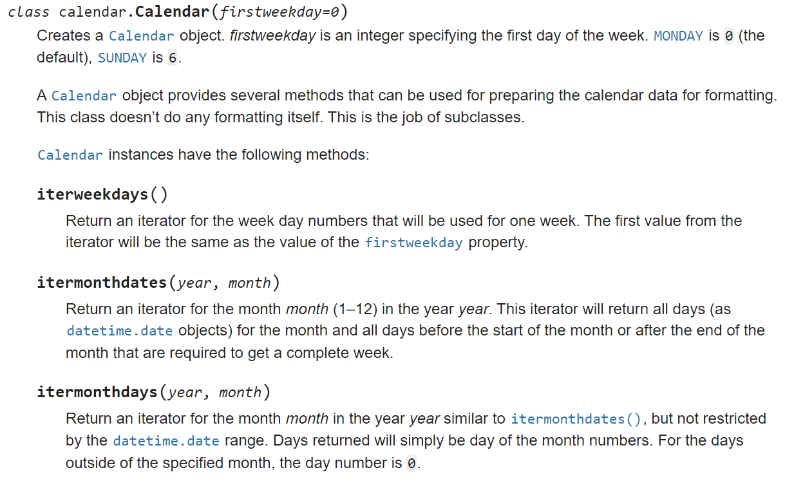
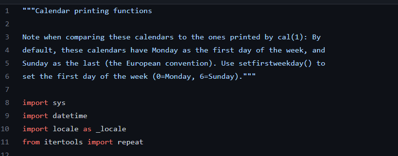
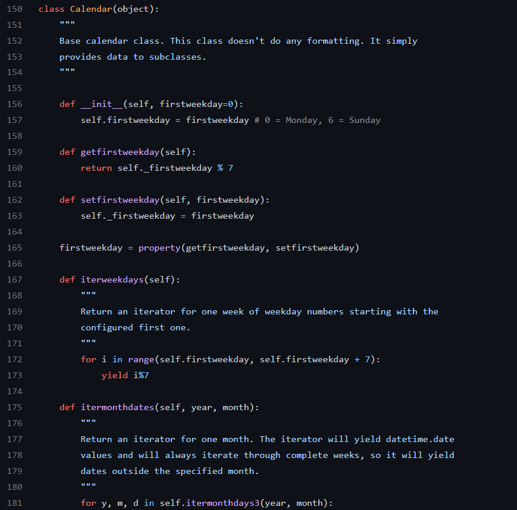

### Standard Python Libraries

https://docs.python.org/3/library/calendar.html 
https://github.com/python/cpython/blob/3.11/Lib/calendar.py

- Lets take a look at an example of some documentation examples from a standard python library the calendar.py
- If we look at the first link we can see some information on the python documentation website about calendar.py

- This shows basic information about the calendar class as well as functions
- The function descriptions contain information about what parameters the functions accept as well as information about what is returned from each function

- Now lets look at some python documentation from the github page of the python library first a look at the header of the library and then a look at some of the same functions we looked at earlier

- It looks like there is alot of the same information available on the github page as there is on the python documenatation website, the main changes seem to be that things are a little bit more technical and we can use helpful inline comments like on line 157

### Characteristics of Documentation to use and Avoid
- Bad documentation makes assumptions about the user
  - This can be as simple as assuming your user knows about the underlying modules, or assuming that they're an expert in the field. By making assumptions about your user you limit the audience of your documentation to a much narrower scope. Imagine if IKEA instructions were written for a carpenter instead of the everyday person. Try making your documentation appeal to a broader audience.
- Bad documentation is difficult to read or written in paragraphs
  - Lengthy documentation can be difficult to decipher and read, especially when the documentation is in-code. Instead of writing out a fully detailed description of every function try to write easy to skim snippets of information. Don't use a lengthy block at the start of the function. A few points along with some inline comments can go a long way. A helpful tip, imagine yourself working with the tool and trying to understand it, if you would have trouble reading through it then its a little too much. Don't overwhelm the user.
- Good documentation uses images to help the user
  - By including images of the tool or package in use, the user can better understand how to use each  tool. Gifs can be especially helpful as they show the user directly what to do with each tool in a specific use. This can be code examples, or even just the direct results of the code itself in use cases.
- Repetition in documentation isn't bad, it can be helpful
  - Often times having to track down one specific piece of information throughout pages of documentation can prove a hassle. Repeating information where it is relevant (though not to excess) can make it easier for the user to find the relevant pieces of documentation and cause less headaches.

### Investigate different Types of Documentation
- https://github.com/basketballrelativity/py_ball 
  - Pyball is an API Wrapper for nba statistics. It uses both in-code documentation as well as having its own separate wiki listed on its github page containing information about each class. You can also find some external documentation listed on other websites.
- https://github.com/pygame/pygame
  - Pygame is a free and open-source library meant for the development of videogame applications using python and serves as a great introduction for those wanting to learn a little bit about game development.Pygame has great documentation by including some sample projects with in-line documentation as well as external documentation on other websites and an entire series of documentation pages on its github.
- https://github.com/hoffstadt/DearPyGui
  - Dear PyGui is a graphical user interface toolkit for python. It incorporates  elements such as buttons, menus, dynamic plots and more to allow for the creation of simple to complex graphical user interfaces. The github page for DearPyGui contains several useful gifs which allow the reader to see direct examples of how the library works, its external documentation also links to several video tutorials as well as an indepth view of its different APIs. Its in code documentation also includes helpful links as well as good descriptions about the arguments and returns of each function.
- https://github.com/pyjokes/pyjokes 
  - Pyjokes is a simple library that contains one line jokes for programmers. The readme and external documentation for Pyjokes are the same and they are relatively small. They contain basic setup and usage instructions with a few code examples as well as liscense and contributer information. The inline documenatition is relatively small but it contains enough information for the user to discover information about each set of jokes and where their origin.
- https://github.com/goldsmith/Wikipedia
  - Wikipedia is a nice library that allows the user to quickly access and parse information from different wikipedia pages. The github documentation includes a basic installation guide as well as several example use cases to show the different methods of the API. The external documentation includes a quickstart guide as well as a link to the full readthedocs page with information about the project

### Now its your turn
- Pick a python library that you are unfamiliar with (don't pick NumPy, Pandas, or something you've seen before) that interests you
- Find examples of the different types of documentation within that library. Show external documentation, in-code documentation, README files and explain what is present in the documentation
- What's missing from the documentation, is there something that could be added to help the user understand the library. If you were using the library what would you include. Write or Include a few examples of what you would add to the documentation.
- Write your own : Remember the flask app you built a few weeks ago. Using what you've learned create some sample documentation for your flask app including documentation in the different styles we've discussed (in-code, readme, external) and be sure to follow the conventions discussed earlier. Include a docstring of both the required routes and the ones that you chose to incorporate into your flask application.
